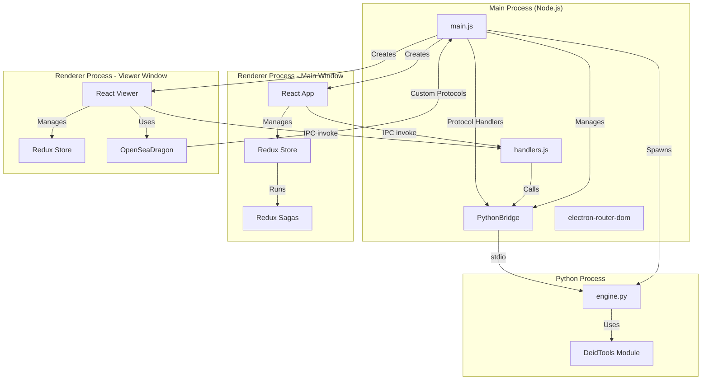

# SlideRelabeler Application Architecture

## 1. Application Overview

SlideRelabeler is a desktop application built with Electron that enables users to select whole-slide image (WSI) files and create deidentified copies. The application removes or replaces existing label and macro images and scrubs HIPAA identifiers from metadata. The app can be configured to automatically upload newly deidentified files to remote servers (currently supporting Digital Slide Archive, with plans for Globus integration).

### High-Level Architecture



### Technology Stack

- **Desktop Framework**: Electron 32.3.3
- **Frontend**: React 18.3.1, Redux Toolkit, Redux Saga
- **Build Tools**: Electron Forge, Vite
- **Python Backend**: Python 3 with large_image, PyInstaller for distribution
- **Image Viewing**: OpenSeaDragon 5.0.0
- **Data Grid**: AG Grid Community
- **Routing**: electron-router-dom, react-router-dom

### Key Architectural Patterns

1. **Multi-Process Architecture**: Main process (Node.js), renderer processes (React), and Python process communicate via IPC and stdio
2. **Custom Protocol Handlers**: Custom URL schemes (`tile://`, `metadata://`, etc.) bridge React components to Python backend
3. **Redux Saga for Async Flows**: All asynchronous operations (file I/O, Python calls, DSA uploads) managed through Redux Sagas
4. **Separate Stores**: Main window and viewer window maintain separate Redux stores
5. **Promise-Based Bridge**: Python bridge uses promise-based request/response pattern with message ID tracking

---

## 2. Electron Backend Functionality

**Location**: [`src/main.js`](src/main.js), [`src/handlers.js`](src/handlers.js), [`src/routers/main-electron-router.js`](src/routers/main-electron-router.js)

### 2.1 Main Process (`src/main.js`)

The main process is the entry point of the Electron application and manages application lifecycle, window creation, and protocol registration.

#### Application Lifecycle

```javascript
// Handle Squirrel events for Windows installer
if (require('electron-squirrel-startup')) {
  app.quit();
}

// Application ready event
app.on('ready', () => {
  // Initialize dev tools in development
  // Create main window
  // Register protocol handlers
  // Initialize PythonBridge
});
```

#### BrowserWindow Creation

- Main window: Created on app ready, 1200x900 pixels
- Viewer windows: Created dynamically when opening files for viewing
- Each window has its own preload script for secure IPC communication

#### PythonBridge Initialization

```javascript
const bridge = new PythonBridge();
```

The bridge is initialized once in the main process and reused for all Python communications.

#### Development Tools

In development mode, React DevTools and Redux DevTools are automatically installed:

```javascript
if (process.env.NODE_ENV === 'development') {
  installExtension(REACT_DEVELOPER_TOOLS);
  installExtension(REDUX_DEVTOOLS);
}
```

### 2.2 Custom Protocol Handlers (`src/main.js`)

**This is a critical architectural feature** that allows React components to request images and metadata using custom URL schemes. These protocols are handled by the Electron main process and forwarded to the Python backend.

#### Protocol Registration

```javascript
protocol.registerSchemesAsPrivileged([
  { scheme: 'metadata', privileges: { secure: true, standard: false, supportFetchAPI: true } },
  { scheme: 'tile', privileges: { secure: true, standard: false, supportFetchAPI: true } },
  { scheme: 'thumbnail', privileges: { secure: true, standard: false, supportFetchAPI: true } },
  { scheme: 'label', privileges: { secure: true, standard: false, supportFetchAPI: true } },
  { scheme: 'macro', privileges: { secure: true, standard: false, supportFetchAPI: true } },
  { scheme: 'preview-label', privileges: { secure: true, standard: false, supportFetchAPI: true } },
  { scheme: 'preview-macro', privileges: { secure: true, standard: false, supportFetchAPI: true } },
  { scheme: 'preview-metadata', privileges: { secure: true, standard: false, supportFetchAPI: true } },
  { scheme: 'image', privileges: { secure: true, standard: false, supportFetchAPI: true } },
]);
```

#### Available Protocol Schemes

1. **`metadata://`** - Returns JSON metadata for a WSI file
   - Format: `metadata://{encoded_file_path}`
   - Returns: JSON object with metadata, associated images list, and file size

2. **`thumbnail://`** - Returns thumbnail image as data URL
   - Format: `thumbnail://{encoded_file_path}`
   - Returns: Base64-encoded image data URL

3. **`tile://`** - Returns deep zoom tiles for OpenSeaDragon
   - Format: `tile://{encoded_file_path}|{level}|{x}|{y}`
   - Returns: Image tile as binary data

4. **`label://`** - Returns label image
   - Format: `label://{encoded_file_path}?{params}`
   - Returns: Base64-encoded image data URL

5. **`macro://`** - Returns macro image
   - Format: `macro://{encoded_file_path}?{params}`
   - Returns: Base64-encoded image data URL

6. **`preview-label://`**, **`preview-macro://`**, **`preview-metadata://`** - Preview versions with configuration parameters
   - Format: `preview-{type}://{encoded_file_path}?{encoded_params}`
   - Used for previewing changes before processing

7. **`image://`** - General image extraction
   - Format: `image://{encoded_file_path}|{encoded_image_name}`

#### Protocol Handler Implementation

Example: Metadata protocol handler

```javascript
protocol.handle('metadata', async (request) => {
  const url = new URL(request.url);
  const value = decodeURIComponent(url.hostname);
  return bridge.invoke('metadata', value)
    .then(result => new Response(JSON.stringify(result), {
      headers: { 'content-type': 'application/json' }
    }))
    .catch(e => console.log('Error fetching metadata', e));
});
```

Example: Tile protocol handler (for OpenSeaDragon)

```javascript
protocol.handle('tile', async (request) => {
  let [base, query] = decodeURI(request.url).slice('tile://'.length).split('?');
  base = decodeURIComponent(base);
  const [file, level, x, y] = base.split('|');
  
  return bridge.invoke('tile', { file, level, x, y })
    .then(fetch)  // Python returns file path, fetch the file
    .catch(e => console.log('Error fetching tile', e));
});
```

#### URL Encoding Patterns

- File paths are URL-encoded using `encodeURIComponent()`
- Query parameters for preview protocols use `encodeURLParameters()` helper
- Decoding happens in protocol handlers using `decodeURIComponent()`

### 2.3 IPC Handlers (`src/handlers.js`)

IPC handlers provide the interface between renderer processes and the main process. All handlers use the `ipcMain.handle()` pattern for request-response communication.

#### File System Operations

**File Dialogs:**
- `open-file-multi-dialog` - Multi-select file picker for WSI files
- `open-file-single-dialog` - Single file picker (CSV files)
- `open-folder-dialog` - Folder selection
- `open-folders-dialog` - Multiple folder selection
- `open-icon-single-dialog` - Image file picker
- `open-save-file-dialog` - Save file dialog with type filters

**File Operations:**
- `copy-file` - Copy file from source to destination
- `delete-file` - Delete a file
- `check-file-exists` - Check if file exists
- `check-file-readable` - Check file read permissions
- `check-file-writeable` - Check file write permissions
- `get-all-wsi-file-paths` - Recursively find WSI files in a directory

**CSV/Excel Handling:**
- `read-csv` - Read CSV file and parse to array of objects
- `write-csv` - Write data array to CSV file
- `read-excel` - Read Excel file and parse to array of objects

#### Python Bridge Invocations

These handlers forward requests to the Python backend via the PythonBridge:

- `metadata` - Get file metadata
- `process-file` - Process a file for deidentification
- `get-progress` - Get processing progress for a file
- `get-errors` - Get error messages from Python
- `get-debugs` - Get debug messages from Python
- `clear-errors` - Clear error message queue
- `clear-debugs` - Clear debug message queue
- `get-output-path` - Calculate output file path
- `preview-metadata` - Preview metadata changes

Example handler:

```javascript
ipcMain.handle('metadata', async (event, file) => {
  return bridge.invoke('metadata', file);
});
```

#### DSA (Digital Slide Archive) API Integration

The DSA integration handles authentication and file uploads to a remote Digital Slide Archive server.

**Authentication:**
- `dsa-login` - Authenticate with DSA server (creates DSAAPI client)
- `dsa-logout` - Logout and clear client

**File Operations:**
- `dsa-upload-file` - Upload file with chunking (64MB chunks)
- `dsa-check-upload-folder` - Verify folder exists and is accessible

**Progress Tracking:**
DSA uploads use event-based communication for progress:
- `dsa-upload-file-progress` - Sent via `webContents.send()` with progress percentage
- `dsa-upload-file-complete` - Sent when upload completes
- `dsa-upload-file-error` - Sent on upload errors

Example: File upload with chunking

```javascript
ipcMain.handle('dsa-upload-file', async (event, folder_id, file_row_idx, file_path) => {
  let response = await dsa_client.begin_upload_file_to_folder(folder_id, file_path);
  if (response[0]) {
    const window = get_browser_window_by_title('SlideRelabeler');
    if (window) {
      await send_file_chunks(window, response[1]._id, file_row_idx, file_path);
    }
  }
  return response;
});
```

#### Store Management

The application persists state to an encrypted file using Electron's `safeStorage` API:

- `get-store` - Load encrypted store from disk
- `set-store` - Save store to encrypted file
- `delete-store` - Delete store and exit application

Store location: `{userData}/deid.tmp`

```javascript
ipcMain.handle('set-store', async (event, data) => {
  let user_data_path = app.getPath('userData');
  let app_data_path = join(user_data_path, 'deid.tmp');
  let encrypted_data = safeStorage.encryptString(JSON.stringify(data));
  writeFileSync(app_data_path, encrypted_data, { encoding: 'utf8' });
});
```

### 2.4 Window Management

#### Main Window Creation

```javascript
const window = new BrowserWindow({
  title: 'SlideRelabeler',
  width: 1200,
  height: 900,
  webPreferences: {
    preload: join(__dirname, `./preload.js`),
  }
});

registerRoute({
  id: 'main',
  browserWindow: window,
  htmlFile: join(__dirname, '..', 'renderer', 'main', 'index.html'),
});
```

#### Viewer Window Creation

Viewer windows are created dynamically when a user opens a file for viewing:

```javascript
ipcMain.handle('open-viewer', async (event, file, row_idx) => {
  const window = new BrowserWindow({
    width: 1200,
    height: 900,
    webPreferences: {
      preload: join(__dirname, `./preload.js`),
    }
  });

  registerRoute({
    id: 'viewer',
    browserWindow: window,
    htmlFile: path.join(__dirname, '..', 'renderer', 'viewer', 'index.html'),
    query: { file: file, row_idx: row_idx }
  });
});
```

#### Router System

The application uses `electron-router-dom` to manage routing between windows:

- Each window has an ID (`main`, `viewer`)
- Routes are registered with `registerRoute()`
- Query parameters can be passed to routes
- The router handles loading the appropriate HTML file for each window

#### Window Lifecycle

- Main window: Clears store on close
- All windows: Clears store when all windows are closed (except on macOS)
- macOS: Application stays active until explicit quit (Cmd+Q)

---

## 3. Frontend Functionality (Electron/React)

**Location**: [`src/main/entry.jsx`](src/main/entry.jsx), [`src/containers/`](src/containers/), [`src/components/`](src/components/), [`src/routers/MainRouter.jsx`](src/routers/MainRouter.jsx), [`src/store/`](src/store/), [`src/reducers/`](src/reducers/), [`src/actions/`](src/actions/), [`src/sagas/`](src/sagas/)

### 3.1 React Application Structure

#### Entry Point (`src/main/entry.jsx`)

```javascript
import React from 'react';
import ReactDOM from 'react-dom/client';
import { Provider } from 'react-redux';
import MainRouter from '../routers/MainRouter.jsx';
import store from '../store';

ReactDOM.createRoot(document.getElementById('root')).render(
  <React.StrictMode>
    <MainRouter/>
  </React.StrictMode>
);
```

#### Main Router (`src/routers/MainRouter.jsx`)

The router defines routes for different windows:

```javascript
const MainRouter = () => {
  return [
    <Router
      main={
        <Route path="/" element={<Provider store={store}><App/></Provider>}/>
      }
      viewer={
        <Route path="/" element={<Provider store={viewer_store}><Viewer/></Provider>}>
          <Route path={":file"} element={<Provider store={viewer_store}><Viewer/></Provider>}/>
        </Route>
      }
    />
  ]
};
```

- Main window uses the main Redux store
- Viewer window uses a separate Redux store
- Each route is wrapped in its own Provider

#### Container Components

**Main Application (`src/containers/App/App.jsx`):**
- Main UI for file selection and processing
- File list display using AG Grid
- Configuration UI
- Process files button and progress display
- DSA upload configuration

**Viewer (`src/containers/Viewer/Viewer.jsx`):**
- Image viewer using OpenSeaDragon
- Displays thumbnails, labels, and macros
- Metadata preview
- Uses custom protocols for image loading

**Modal System (`src/containers/Modal/`):**
- `Modal.jsx` - Base modal component
- `ModalConfig.jsx` - Configuration modal
- `ModalDebug.jsx` - Debug messages modal
- `ModalError.jsx` - Error display modal
- `ModalHelp.jsx` - Help content
- `ModalImage.jsx` - Image display modal
- `ModalMetadata.jsx` - Metadata display modal
- `ModalWarning.jsx` - Warning messages

#### Presentational Components (`src/components/`)

- **AgGrid** (`src/components/AgGrid/`) - Data grid components for file lists and metadata
- **OpenSeaDragon** (`src/components/OpenSeaDragon/`) - Wrapper for OpenSeaDragon viewer
- **Controls** (`src/components/controls/`) - Reusable form controls (button, checkbox, dropdown, input)
- **FileHeaderInfo** - Displays file header information
- **Table** - Custom table components

### 3.2 Redux State Management

#### Store Configuration

**Main Store (`src/store/index.js`):**

```javascript
import { configureStore } from '@reduxjs/toolkit';
import createSagaMiddleware from 'redux-saga';
import reducer from '../reducers';
import saga from '../sagas';

const sagaMiddleware = createSagaMiddleware();
const store = configureStore({
  reducer,
  middleware: (getDefaultMiddleware) => 
    getDefaultMiddleware({ thunk: false }).concat(sagaMiddleware),
});

sagaMiddleware.run(saga);
export default store;
```

**Viewer Store (`src/store/viewer/index.js`):**

Similar structure but with viewer-specific reducer and sagas.

#### Reducers (`src/reducers/`)

The application uses Redux Toolkit's `createReducer` with Immer for immutable updates:

1. **`files/`** - File management state
   - `file_rows` - Array of file objects with metadata
   - `count` - Total file count
   - `output_dir` - Output directory path
   - `processing` - Whether files are currently being processed
   - `processing_files` - Array of files currently processing
   - `totalBytes`, `remainingBytes` - Progress tracking

2. **`app/`** - Application-level state
   - UI state, viewer state flags

3. **`config/`** - Configuration settings
   - Deidentification settings
   - Output preferences
   - Debug settings

4. **`debug/`** - Debug and error messages
   - `errors` - Array of error messages
   - `debugs` - Array of debug messages

5. **`dsa/`** - DSA upload state
   - Login status
   - Upload configuration
   - Upload progress

6. **`modal/`** - Modal visibility and content
   - Current modal type
   - Modal data/payload

7. **`viewer/`** - Viewer-specific state
   - Current file being viewed
   - Viewer settings

#### Actions (`src/actions/`)

Actions are organized by domain:
- `files.js` - File operations (ADD_FILES, PROCESS_FILES, etc.)
- `app.js` - Application actions
- `config.js` - Configuration actions
- `debug.js` - Debug/error actions
- `dsa.js` - DSA operations
- `modal.js` - Modal actions
- `viewer.js` - Viewer actions

#### State Persistence

State is automatically saved to encrypted store via sagas. The `save_store` saga watches all actions and persists state:

```javascript
function* save_store() {
  while(true) {
    const action = yield take('*');
    const store = yield select();
    const response = yield set_store(store);
  }
}
```

### 3.3 Redux Sagas (`src/sagas/`)

**Critical for understanding async flows** - All asynchronous operations are managed through Redux Sagas.

#### Saga Architecture

**Root Saga (`src/sagas/index.js`):**

```javascript
function* sagas() {
  yield fork(app);
  yield fork(files);
  yield fork(config);
  yield fork(debug);
  yield fork(dsa);
  
  yield load_saved_store();
  yield put({type: files_actions.NOT_PROCESSING});
  
  yield fork(save_store);
  yield fork(delete_store);
}
```

**Domain-Specific Sagas:**
- `files/` - File operations (add, process, metadata retrieval)
- `app/` - Application-level sagas
- `config/` - Configuration management
- `debug/` - Debug message retrieval
- `dsa/` - DSA upload operations
- `viewer/` - Viewer-specific operations
- `bridge/` - Store persistence

#### Saga Patterns

**Action Watching:**
```javascript
// Watch for specific action
export default function* add_files() {
  while (true) {
    const action = yield take(files_actions.ADD_FILES);
    // Handle action
  }
}

// Watch for latest action (cancels previous)
yield takeLatest(files_actions.PROCESS_FILES, process_files_worker);

// Watch for every action
yield takeEvery(files_actions.GET_METADATA, get_metadata);
```

**Forking and Cancellation:**
```javascript
// Fork a task
const task = yield fork(process_files_worker);

// Cancel a task
yield cancel(task);
```

**Calling Electron API:**
```javascript
// In sagas, electronAPI is available globally
const files = yield electronAPI.openFileMultiDialog();
const metadata = yield call(electronAPI.getMetadata, file_path);
```

**Error Handling:**
```javascript
try {
  const result = yield call(electronAPI.processFile, info);
} catch (err) {
  yield put({ type: debug_actions.ADD_BACKEND_ERROR_MESSAGE, payload: err });
}
```

#### Key Saga Flows

**File Addition Workflow:**
1. User clicks "Add Files" → `ADD_FILES` action
2. Saga calls `electronAPI.openFileMultiDialog()`
3. File info is processed and added to Redux state
4. Metadata retrieval is triggered for each file

**File Processing Workflow:**
1. User clicks "Process Files" → `PROCESS_FILES` action
2. `process_files` saga starts worker
3. For each file:
   - Copy file to output directory
   - Call `electronAPI.processFile()` → Python `deid-process`
   - Monitor progress via `get-progress`
   - Update Redux state with progress
4. On completion, update file status

**Metadata Retrieval:**
1. File added → `GET_METADATA` action triggered
2. Saga calls `electronAPI.getMetadata(file_path)`
3. IPC handler forwards to Python bridge
4. Python returns metadata
5. Redux state updated with metadata

**DSA Upload Workflow:**
1. User configures DSA and clicks upload
2. Saga sets up event listeners for progress
3. Calls `electronAPI.dsaUploadFile()`
4. Electron main process handles chunked upload
5. Progress events sent via `webContents.send()`
6. Saga dispatches progress updates to Redux
7. On completion, cleanup and state update

### 3.4 Frontend-to-Electron Communication

#### Preload Script (`src/preload.js`)

The preload script runs in the renderer process before the page loads and sets up secure IPC communication:

```javascript
import './bridge/electronAPI.js';
```

The actual API is defined in `src/bridge/electronAPI.js` and exposed via context bridge.

#### Context Bridge Setup (`src/bridge/electronAPI.js`)

```javascript
import { contextBridge, ipcRenderer } from 'electron';

const API = {
  openFileMultiDialog: () => ipcRenderer.invoke('open-file-multi-dialog'),
  getMetadata: (file_path) => ipcRenderer.invoke('metadata', file_path),
  processFile: (info) => ipcRenderer.invoke('process-file', info),
  // ... more methods
};

contextBridge.exposeInMainWorld('electronAPI', API);
```

This makes `window.electronAPI` available in the renderer process.

#### Electron API Surface

**File Operations:**
- `openFileIconDialog()`, `openFileMultiDialog()`, `openFileSingleDialog()`
- `openFolderDialog()`, `openFoldersDialog()`
- `getAllWSIFilePaths(folder_path)`
- `openSaveFileDialog(file_types)`
- `readCSV(file_path)`, `writeCSV(file_path, data)`
- `readExcel(file_path)`
- `copyFile(source, destination)`
- `deleteFile(file_path)`
- `checkFileExists(file_path)`, `checkFileReadable(file_path)`, `checkFileWriteable(file_path)`

**Python Bridge:**
- `getMetadata(file_path)`
- `processFile(info)`
- `getProgress(info, output_path)`
- `getCopyProgress(id)`
- `getErrors()`, `clearErrors()`
- `getDebugs()`, `clearDebugs()`
- `getOutputPath(info)`
- `previewMetadata(output_dict)`
- `cancelRestartBridge()`

**Store Management:**
- `getStore()`
- `setStore(store)`
- `deleteStore()`

**DSA Operations:**
- `dsaLogin(api_url, username, password)`
- `dsaLogout()`
- `dsaUploadFile(folder_id, file_row_idx, file_path)`
- `dsaCheckUploadFolder(folder_id)`
- `dsaSetupUploadComplete(dispatch)` - Sets up event listener
- `dsaSetupUploadFileProgress(dispatch)` - Sets up progress listener
- `dsaSetupUploadFileError(dispatch)` - Sets up error listener
- `dsaStopUploadComplete()`, `dsaStopUploadFileProgress()`, `dsaStopUploadFileError()` - Remove listeners

**Window Management:**
- `openViewer(file, row_idx)`
- `openImage(image_url)`

**Platform Utilities:**
- `getPlatform()`

#### Usage Patterns

**In Sagas:**
```javascript
// electronAPI is available globally in sagas
const files = yield electronAPI.openFileMultiDialog();
const metadata = yield call(electronAPI.getMetadata, file_path);
```

**In Components:**
```javascript
// Use window.electronAPI
useEffect(() => {
  window.electronAPI.getMetadata(file).then(md => {
    setMetadata(md);
  });
}, [file]);
```

**Event-Based Communication (DSA):**
```javascript
// Setup listeners (returns cleanup function)
const progressListener = yield electronAPI.dsaSetupUploadFileProgress(dispatch);

// Later, remove listeners
yield electronAPI.dsaStopUploadFileProgress();
```

### 3.5 Viewer Window Architecture

The viewer window has a separate architecture from the main window:

#### Separate Redux Store

The viewer uses its own Redux store (`src/store/viewer/index.js`) with:
- Viewer-specific reducer
- Viewer-specific sagas
- Isolated state from main window

#### Viewer-Specific Sagas

Located in `src/sagas/viewer/`, these handle:
- Preview metadata operations
- Viewer-specific async operations

#### OpenSeaDragon Integration

The viewer uses OpenSeaDragon for deep zoom image viewing:

```javascript
// From src/components/OpenSeaDragon/OpenSeadragon.jsx
viewerRef.current = new OpenSeadragon({
  id: 'osd',
  tileSources: tileSources[0],
  drawer: 'webgl',
  maxImageCacheCount: 1000,
});
```

**Tile Source Creation:**
- For tiled images: Uses `tile://` protocol with level/x/y coordinates
- For simple images: Uses `tile://` protocol with level 0
- Associated images: Uses `label://`, `macro://`, `thumbnail://` protocols

**Custom Protocol Usage:**
OpenSeaDragon requests tiles via custom protocols:
```javascript
url: `tile://` + window.encodeURIComponent(`${file}|${level}|${x}|${y}`)
```

These requests are handled by protocol handlers in the main process, which forward them to Python.

#### Communication with Main Window

The viewer window is independent but can:
- Receive file and row_idx via route query parameters
- Use the same IPC handlers as the main window
- Access the same Python backend via protocol handlers

---

## 4. Python Backend Functionality

**Location**: [`src/python/engine.py`](src/python/engine.py), [`src/python/DeidTools/`](src/python/DeidTools/)

### 4.1 Python Engine (`src/python/engine.py`)

The Python engine is a long-running process that communicates with Electron via stdin/stdout using JSON messages.

#### Entry Point and Initialization

```python
if __name__ == '__main__':
    import multiprocessing
    multiprocessing.freeze_support()  # Required for PyInstaller
    
    # Environment setup
    # Platform-specific path configuration
    # Import large_image and DeidTools
    
    listenToInput()  # Main message loop
```

#### Environment Setup

**Platform-Specific Paths:**
- Windows: Sets up GDAL_DATA path for production builds
- macOS: Configures paths for production
- Development: Uses local Python environment

**Library Initialization:**
- `large_image` - For reading whole-slide images
- `pyproj` - Sets PROJ_DATA environment variable
- `DeidTools` - Core deidentification functionality

#### Message Listening Loop

The engine listens for JSON messages on stdin:

```python
def listenToInput():
    counter = 0
    for line in sys.stdin:
        counter = counter + 1
        
        # Parse JSON message
        input = json.loads(line)
        id = input.get('_id')
        data = input.get('data')
        
        # Extract function name and parameters
        requestedFunction = data.get('function')
        inputData = data.get('data')
        
        # Dispatch to appropriate function
        if requestedFunction == 'metadata':
            Response(id, lambda: getMetadata(inputData))
        elif requestedFunction == 'tile':
            Response(id, lambda: getTile(inputData))
        # ... more functions
```

**Message Format:**
```json
{
  "_id": 123,
  "data": {
    "function": "metadata",
    "data": "/path/to/file.svs"
  }
}
```

#### Response Handling

The `Response` class encapsulates sending responses back to Electron:

```python
class Response:
    def __init__(self, id, func=None, rejectMessage=None):
        self.id = id
        if rejectMessage is not None:
            self.error(rejectMessage)
        else:
            try:
                self.success(func())
            except:
                exc_info = sys.exc_info()
                e = ''.join(traceback.format_exception(*exc_info))
                self.error(e)
    
    def success(self, s):
        sendToElectron('success', s, self.id)
    
    def error(self, e):
        sendToElectron('error', e, self.id)
```

**Response Format:**
```json
{
  "type": "success",
  "data": { /* result data */ },
  "_id": 123
}
```

#### Debug and Error Management

The engine maintains queues for debug and error messages:

```python
debug_msgs = deque()
error_msgs = deque()
max_debug_msgs = 100
max_error_msgs = 100
```

- Messages are added to queues with rotation (FIFO when limit reached)
- Can be retrieved via `get-errors` and `get-debugs` functions
- Can be cleared via `clear-errors` and `clear-debugs` functions

### 4.2 Available Python Functions

All functions are invoked via the message loop and return responses through the `Response` class.

#### Image Extraction Functions

- **`metadata`** - Get file metadata and associated images list
  - Input: File path (string)
  - Returns: Dict with `metadata`, `associatedImages`, `bytes`

- **`thumbnail`** - Get thumbnail image
  - Input: File path (string)
  - Returns: Base64 data URL string

- **`macro`** - Get macro image
  - Input: File path (string)
  - Returns: Base64 data URL string

- **`label`** - Get label image
  - Input: File path (string)
  - Returns: Base64 data URL string

- **`image`** - Get specific associated image
  - Input: Dict with `file` and `image` keys
  - Returns: Base64 data URL string

- **`tile`** - Get deep zoom tile
  - Input: Dict with `file`, `level`, `x`, `y` keys
  - Returns: File path to tile (fetched by Electron)

#### Preview Functions

- **`preview-metadata`** - Preview metadata changes before processing
  - Input: Dict with file info and configuration
  - Returns: Tuple of (prior_ifds, new_ifds, redactList)

- **`preview-label`** - Preview label image with changes
  - Input: Dict with file info and configuration
  - Returns: Base64 data URL string

- **`preview-macro`** - Preview macro image with changes
  - Input: Dict with file info and configuration
  - Returns: Base64 data URL string

#### Processing Functions

- **`deid-process`** - Process file for deidentification
  - Input: Dict with file info and configuration
  - Returns: Processing info dict

#### Utility Functions

- **`get-progress`** - Get processing progress
  - Input: Output dict
  - Returns: Progress information

- **`get-errors`** - Get error message queue
  - Returns: JSON string of error messages array

- **`get-debugs`** - Get debug message queue
  - Returns: JSON string of debug messages array

- **`clear-errors`** - Clear error message queue
  - Returns: None

- **`clear-debugs`** - Clear debug message queue
  - Returns: None

- **`get-output-path`** - Calculate output file path
  - Input: Output dict
  - Returns: Output file path string

### 4.3 DeidTools Module (`src/python/DeidTools/`)

The DeidTools module contains the core deidentification functionality.

#### Core Components

- **`DeidTools.py`** - Main class with deidentification methods
- **`wsi_deid_process.py`** - WSI processing workflow
- **`wsi_deid_config.py`** - Configuration management
- **`wsi_deid_constants.py`** - Constants and defaults
- **`DeIdImageItem.py`** - Image item handling
- **`cleanup_tiff_tags.py`** - TIFF tag cleanup
- **`file_io.py`** - File I/O operations

#### Key Functionality

1. **Metadata Manipulation:**
   - Scrub HIPAA identifiers from TIFF tags
   - Remove or modify specific metadata fields
   - Preserve necessary metadata for image viewing

2. **Image Processing:**
   - Extract and manipulate label images
   - Extract and manipulate macro images
   - Generate thumbnails
   - Create deep zoom tiles

3. **File Operations:**
   - Read whole-slide images using large_image
   - Write processed images
   - Handle various WSI formats (SVS, NDPI, TIFF, etc.)

4. **Configuration:**
   - Apply user configuration to processing
   - Handle preview vs. actual processing modes

---

## 5. Electron-to-Python Bridge

**Location**: [`src/bridge/pythonBridge.js`](src/bridge/pythonBridge.js), [`src/main.js`](src/main.js)

### 5.1 PythonBridge Class (`src/bridge/pythonBridge.js`)

The PythonBridge class manages the Python process lifecycle and communication.

#### Initialization and Path Detection

The bridge detects the Python executable path based on environment:

```javascript
constructor(sendToBrowser) {
  const usePyinstaller = process.argv.includes('pyinstaller') || 
    fs.existsSync(path.join(process.resourcesPath, 'engine', 'engine'));
  
  let engine = null;
  if (process.platform === 'win32') {
    engine = 'engine.exe';
  } else {
    engine = 'engine.app';
  }
  
  // Development mode
  if (!usePyinstaller && process.env.NODE_ENV === 'development') {
    this._python = './src/python/engine.py';
  }
  // Production mode - PyInstaller executable
  else if (fs.existsSync(path.join(process.resourcesPath, 'engine', engine))) {
    this._pathToPython = path.join(process.resourcesPath, 'engine', engine);
  }
  // ... more path resolution
}
```

**Path Resolution Priority:**
1. Development: `./src/python/engine.py`
2. Local PyInstaller build: `./dist/engine/{engine}`
3. Packaged executable: `{resourcesPath}/engine/{engine}`

#### PythonShell Implementation

The bridge uses a custom PythonShell implementation (based on python-shell package):

```javascript
const options = {
  mode: 'json',
  stdio: ['pipe', 'pipe', 'pipe', 'pipe'],
  pythonPath: this._pathToPython
};

this._shell = new PythonShell(this._python, options);
```

**NewlineTransformer:**
Messages are split by newlines to ensure complete JSON parsing:
- Reads from stdout in chunks
- Buffers incomplete lines
- Emits complete lines as messages

**Event Handling:**
```javascript
this._shell.on('message', msg => {
  switch(msg.type) {
    case 'debug':
      this._log(msg.data);
      break;
    case 'success':
      const promise = this._promises[msg._id];
      if (promise) {
        promise.resolve(msg.data);
        delete this._promises[msg._id];
      }
      break;
    case 'error':
      const promise = this._promises[msg._id];
      if (promise) {
        promise.reject(msg.data);
        delete this._promises[msg._id];
      }
      break;
  }
});
```

#### Message Management

**Message ID Tracking:**
Each request gets a unique message ID:

```javascript
this._messageId = 0;
this._promises = {};

// When sending
let message = {
  _id: this._messageId,
  data: data
};
this._promises[message._id] = {};
const promise = new Promise((resolve, reject) => {
  this._promises[message._id].resolve = resolve;
  this._promises[message._id].reject = reject;
});
this._messageId += 1;
```

**Promise-Based Request/Response:**
The `invoke` method returns a promise:

```javascript
async invoke(func, data, log) {
  if (log) {
    this._log(`Invoking ${func} on shell:`, data);
  }
  return this._shell ? 
    this._shell.send({function: func, data: data}) : 
    Promise.reject('Python shell does not exist');
}
```

### 5.2 Communication Protocol

#### Message Format

**Request Structure:**
```json
{
  "_id": 123,
  "data": {
    "function": "metadata",
    "data": "/path/to/file.svs"
  }
}
```

**Response Structure:**
```json
{
  "type": "success",
  "data": { /* result */ },
  "_id": 123
}
```

**Message Types:**
- `success` - Successful operation with result data
- `error` - Error occurred with error message
- `debug` - Debug message (doesn't resolve promises)

#### Communication Flow

1. **Request Sent:**
   - Electron calls `bridge.invoke('metadata', file_path)`
   - Message formatted with unique `_id`
   - Promise created and stored in `_promises` map
   - Message sent to Python via stdin (JSON + newline)

2. **Python Processing:**
   - Python reads line from stdin
   - Parses JSON message
   - Executes requested function
   - Sends response via stdout (JSON + newline)

3. **Response Received:**
   - PythonShell receives message on stdout
   - Parses JSON response
   - Looks up promise by `_id`
   - Resolves or rejects promise with data

4. **Promise Resolution:**
   - Original `invoke()` call's promise resolves
   - Caller receives result data

#### Error Handling

**Python Process Errors:**
- Process spawn failures
- Process crashes
- Stderr output captured and logged

**Message Parsing Errors:**
- Invalid JSON from Python
- Missing required fields
- Errors logged and promise rejected

**Missing Promise Errors:**
- Response received with unknown `_id`
- Indicates message ID mismatch
- Logged as error

---

## 6. Interprocess Communication (IPC)

**Location**: [`src/preload.js`](src/preload.js), [`src/bridge/electronAPI.js`](src/bridge/electronAPI.js), [`src/handlers.js`](src/handlers.js), [`src/sagas/`](src/sagas/)

### 6.1 IPC Architecture Overview

#### Process Model

The application uses Electron's multi-process architecture:

1. **Main Process (Node.js)**
   - Single instance
   - Manages application lifecycle
   - Handles IPC requests
   - Manages Python process

2. **Renderer Processes (React)**
   - One per BrowserWindow
   - Main window renderer
   - Viewer window renderer(s)
   - Isolated from Node.js APIs (security)

3. **Python Process**
   - Separate process spawned by main process
   - Communicates via stdio (stdin/stdout)
   - Long-running process

#### Communication Channels

- **Main ↔ Renderer**: IPC (invoke/handle, on/send)
  - Secure communication via context bridge
  - Request-response pattern
  - Event-based for progress updates

- **Main ↔ Python**: stdio (stdin/stdout)
  - JSON message protocol
  - Promise-based request/response
  - Message ID tracking

- **Renderer ↔ Python**: Indirect (via Main)
  - Renderer cannot directly communicate with Python
  - All communication goes through main process
  - Main process acts as bridge

### 6.2 IPC Patterns

#### Request-Response Pattern

**Most common pattern** - Used for file operations, Python calls, store management:

```javascript
// Renderer (via electronAPI)
const result = await window.electronAPI.getMetadata(file_path);

// Main process handler
ipcMain.handle('metadata', async (event, file) => {
  return bridge.invoke('metadata', file);
});
```

**Characteristics:**
- Promise-based (async/await)
- One request, one response
- Error handling via promise rejection
- Used for: file dialogs, Python invocations, store operations

#### Event-Based Pattern

**Used for progress updates** - DSA uploads use this pattern:

```javascript
// Renderer - Setup listener
electronAPI.dsaSetupUploadFileProgress((event, progress) => {
  dispatch({ type: files_actions.UPDATE_FILE_UPLOAD_PROGRESS, payload: progress });
});

// Main process - Send event
window.webContents.send('dsa-upload-file-progress', { 
  file_path: file_path, 
  progress: progress, 
  row_idx: file_row_idx 
});
```

**Characteristics:**
- One-way communication (main → renderer)
- Multiple events per operation
- Requires listener setup/teardown
- Used for: progress updates, completion notifications

### 6.3 API Surface (`src/bridge/electronAPI.js`)

The API is organized by functional category:

#### File Operations

**Dialogs:**
- `openFileIconDialog()` - Image file picker
- `openFileMultiDialog()` - Multi-select WSI file picker
- `openFileSingleDialog()` - Single CSV file picker
- `openFolderDialog()` - Folder selection
- `openFoldersDialog()` - Multiple folder selection
- `openSaveFileDialog(file_types)` - Save file dialog

**File I/O:**
- `getAllWSIFilePaths(folder_path)` - Recursively find WSI files
- `readCSV(file_path)` - Read and parse CSV
- `writeCSV(file_path, data)` - Write data to CSV
- `readExcel(file_path)` - Read and parse Excel
- `copyFile(source, destination)` - Copy file
- `deleteFile(file_path)` - Delete file
- `checkFileExists(file_path)` - Check existence
- `checkFileReadable(file_path)` - Check read permission
- `checkFileWriteable(file_path)` - Check write permission

#### Python Bridge

**Metadata and Images:**
- `getMetadata(file_path)` - Get file metadata
- `previewMetadata(output_dict)` - Preview metadata changes

**Processing:**
- `processFile(info)` - Process file for deidentification
- `getProgress(info, output_path)` - Get processing progress
- `getCopyProgress(id)` - Get file copy progress
- `getOutputPath(info)` - Calculate output path
- `cancelRestartBridge()` - Restart Python bridge

**Debug/Error:**
- `getErrors()` - Get error messages
- `clearErrors()` - Clear error queue
- `getDebugs()` - Get debug messages
- `clearDebugs()` - Clear debug queue

#### Store Management

- `getStore()` - Load encrypted store
- `setStore(store)` - Save encrypted store
- `deleteStore()` - Delete store and exit

#### DSA Operations

**Authentication:**
- `dsaLogin(api_url, username, password)` - Login to DSA
- `dsaLogout()` - Logout from DSA

**File Operations:**
- `dsaUploadFile(folder_id, file_row_idx, file_path)` - Upload file
- `dsaCheckUploadFolder(folder_id)` - Verify folder

**Event Listeners:**
- `dsaSetupUploadComplete(dispatch)` - Setup completion listener
- `dsaSetupUploadFileProgress(dispatch)` - Setup progress listener
- `dsaSetupUploadFileError(dispatch)` - Setup error listener
- `dsaStopUploadComplete()` - Remove completion listener
- `dsaStopUploadFileProgress()` - Remove progress listener
- `dsaStopUploadFileError()` - Remove error listener

#### Window Management

- `openViewer(file, row_idx)` - Open viewer window
- `openImage(image_url)` - Open image in new window

#### Platform Utilities

- `getPlatform()` - Get OS platform (win32, darwin, linux)
- `onLog(callback)` - Setup log message listener

### 6.4 Error and Debug Message Flow

#### Python → Electron

Python sends messages via stdout:

```python
def sendToElectron(messageType, data, id=None):
    json_dump = json.dumps(dict(type=messageType, data=data, _id=id))
    print(json_dump)
    sys.stdout.flush()
```

**Message Types:**
- `success` - Function completed successfully
- `error` - Function failed with error
- `debug` - Debug information (doesn't resolve promises)

#### Electron → Frontend

Electron exposes error/debug retrieval via IPC:

```javascript
ipcMain.handle('get-errors', async (event) => {
  try {
    return bridge.invoke('get-errors');
  } catch (e) {
    return [{ message: "Cannot get errors. Is the python bridge process running?", error: e }];
  }
});
```

#### Frontend Display

Frontend retrieves messages via sagas:

```javascript
// Saga watches for actions and retrieves messages
function* get_backend_error_messages() {
  while (true) {
    yield delay(1000);
    const error_messages = yield electronAPI.getErrors();
    // Update Redux state
  }
}
```

Messages are stored in Redux state and displayed in UI components (ModalDebug, ModalError).

---

## 7. Data Flow Examples

### Adding Files

**Complete flow from user action to Redux state:**

1. **User Action**: User clicks "Add Files" button
   - Dispatches `ADD_FILES` action

2. **Saga Intercepts**: `add_files` saga watches for action
   ```javascript
   const file_or_files = yield electronAPI.openFileMultiDialog();
   ```

3. **IPC Request**: `electronAPI` calls `ipcRenderer.invoke('open-file-multi-dialog')`

4. **Main Process Handler**: `handlers.js` shows file dialog
   ```javascript
   ipcMain.handle('open-file-multi-dialog', async () => {
     return dialog.showOpenDialog({ 
       filters: [wsiCustomFilter], 
       properties: ['openFile', 'multiSelections'] 
     });
   });
   ```

5. **File Info Creation**: Selected files converted to file info objects
   ```javascript
   const fileList = makeFileInfo(d.filePaths.map(f => { return { source: f } }));
   ```

6. **Response**: File list returned to renderer via IPC

7. **Saga Processing**: Files processed and added to Redux
   ```javascript
   let file_row = yield make_file_row(file);
   yield put({ type: files_actions.ADD_FILE_ROW, payload: file_row });
   ```

8. **Metadata Retrieval**: Saga triggers metadata fetch for each file
   ```javascript
   yield put({ type: files_actions.UPDATE_FILES_WITHOUT_METADATA });
   ```

### Processing a File

**Complete flow from process action to completion:**

1. **User Action**: User clicks "Process Files"
   - Dispatches `PROCESS_FILES` action

2. **Saga Worker**: `process_files` saga starts worker
   ```javascript
   function* process_files_worker() {
     for (let file_row_idx in file_rows) {
       let result = yield call(process_file, file_row_idx, file_row);
     }
   }
   ```

3. **File Copy**: File copied to output directory
   ```javascript
   // In process_file saga
   const copy_result = yield call(electronAPI.copyFile, source, destination);
   ```

4. **Python Processing**: Process file via Python
   ```javascript
   const processed_file = yield call(electronAPI.processFile, info);
   ```

5. **IPC Chain**: 
   - Renderer → IPC → Main → Python Bridge → Python Engine
   - Python processes file using DeidTools
   - Response flows back: Python → Bridge → Main → IPC → Renderer

6. **Progress Monitoring**: Saga polls for progress
   ```javascript
   const progress_info = yield electronAPI.getProgress(info, output_path);
   yield put({ type: files_actions.UPDATE_FILE_PROGRESS, payload: progress });
   ```

7. **Completion**: File marked as processed in Redux state
   ```javascript
   yield put({ type: files_actions.PROCESSED_FILE, payload: file_row_idx });
   ```

### Viewing an Image

**Complete flow from viewer component to displayed image:**

1. **Viewer Component**: Component requests image via custom protocol
   ```javascript
   // In Viewer.jsx
   set_label_url(`label://${file_encoded}?${params}`);
   ```

2. **OpenSeaDragon**: Requests tile via custom protocol
   ```javascript
   // In OpenSeadragon.jsx
   url: `tile://` + window.encodeURIComponent(`${file}|${level}|${x}|${y}`)
   ```

3. **Protocol Handler**: Main process handles protocol request
   ```javascript
   protocol.handle('tile', async (request) => {
     const [file, level, x, y] = base.split('|');
     return bridge.invoke('tile', { file, level, x, y });
   });
   ```

4. **Python Bridge**: Forwards to Python
   ```javascript
   bridge.invoke('tile', { file, level, x, y })
   ```

5. **Python Engine**: Extracts tile from WSI
   ```python
   def getTile(inputData):
       source = openFile(inputData['file'])
       tile = source.getTile(int(inputData['level']), 
                              int(inputData['x']), 
                              int(inputData['y']))
       return tile['path']  # Returns file path
   ```

6. **Response**: Tile file path returned

7. **Image Display**: OpenSeaDragon loads and displays tile

### DSA Upload

**Complete flow from upload action to completion:**

1. **User Action**: User configures DSA and triggers upload
   - Dispatches upload action

2. **Saga Setup**: Saga sets up event listeners
   ```javascript
   let progress_listener = yield electronAPI.dsaSetupUploadFileProgress(dispatch);
   let complete_listener = yield electronAPI.dsaSetupUploadComplete(dispatch);
   ```

3. **Upload Initiation**: Saga calls upload function
   ```javascript
   const upload_response = yield electronAPI.dsaUploadFile(folder_id, row_idx, file_path);
   ```

4. **Main Process**: Handles chunked upload
   ```javascript
   ipcMain.handle('dsa-upload-file', async (event, folder_id, file_row_idx, file_path) => {
     let response = await dsa_client.begin_upload_file_to_folder(folder_id, file_path);
     await send_file_chunks(window, response[1]._id, file_row_idx, file_path);
   });
   ```

5. **Chunked Upload**: File sent in 64MB chunks
   ```javascript
   async function send_file_chunks(window, upload_id, file_row_idx, file_path) {
     const chunk_size = 64 * 1024 * 1024; // 64MB
     for (let data_offset = 0; data_offset < file_size; data_offset += chunk_size) {
       await read_and_send_file_chunk(/* ... */);
       // Send progress event
       window.webContents.send('dsa-upload-file-progress', { progress: progress });
     }
   }
   ```

6. **Progress Events**: Main process sends progress events
   ```javascript
   window.webContents.send('dsa-upload-file-progress', { 
     file_path: file_path, 
     progress: progress, 
     row_idx: file_row_idx 
   });
   ```

7. **Saga Updates**: Event listeners dispatch Redux actions
   ```javascript
   ipcRenderer.on('dsa-upload-file-progress', (event, progress) => {
     dispatch({ type: files_actions.UPDATE_FILE_UPLOAD_PROGRESS, payload: progress });
   });
   ```

8. **Completion**: Upload complete event sent
   ```javascript
   window.webContents.send('dsa-upload-file-complete', file_row_idx);
   ```

9. **Cleanup**: Listeners removed, state updated
   ```javascript
   yield electronAPI.dsaStopUploadComplete();
   yield electronAPI.dsaStopUploadFileProgress();
   ```

### Store Persistence

**Complete flow from state change to encrypted storage:**

1. **State Change**: Any Redux action dispatched
   ```javascript
   yield put({ type: files_actions.ADD_FILE_ROW, payload: file_row });
   ```

2. **Saga Watches**: `save_store` saga watches all actions
   ```javascript
   function* save_store() {
     while(true) {
       const action = yield take('*');  // Watch all actions
       const store = yield select();     // Get current state
       const response = yield set_store(store);
     }
   }
   ```

3. **IPC Call**: Store saved via IPC
   ```javascript
   function* set_store(data) {
     yield call(electronAPI.setStore, data);
   }
   ```

4. **Main Process**: Encrypts and saves to file
   ```javascript
   ipcMain.handle('set-store', async (event, data) => {
     let encrypted_data = safeStorage.encryptString(JSON.stringify(data));
     writeFileSync(app_data_path, encrypted_data);
   });
   ```

5. **File Location**: Saved to `{userData}/deid.tmp`

6. **On App Start**: Store loaded automatically
   ```javascript
   yield load_saved_store();  // In root saga
   ```

---

## 8. Build and Distribution

**Location**: [`forge.config.js`](forge.config.js), [`pyinstaller/engine.spec`](pyinstaller/engine.spec)

### Electron Forge Configuration

Electron Forge is used for building and packaging the application:

```javascript
module.exports = {
  packagerConfig: {
    asar: true,
    icon: './src/assets/BDSA-icon',
    extraResource: ['./dist/engine.app'],  // or engine.exe on Windows
    ignore: [
      "/\.pyenv.*/",
      "/pyinstaller/",
      "/build/engine",
      "dist",
      "temp"
    ]
  }
};
```

### PyInstaller Integration

The Python backend is packaged as a standalone executable using PyInstaller:

**Build Process:**
1. PyInstaller runs before Electron packaging
2. Creates executable in `dist/engine/`
3. Executable bundled as extra resource in Electron app
4. Platform-specific executables: `engine.exe` (Windows), `engine.app` (macOS)

**Build Hooks:**
```javascript
hooks: {
  prePackage: async (forgeConfig) => {
    // Clean directories
    // Run pyinstaller
    execSync('pyinstaller -y --clean ./pyinstaller/engine.spec');
  }
}
```

### Platform-Specific Builds

- **Windows**: Builds `.exe` installer using Squirrel
- **macOS**: Builds `.app` bundle and `.dmg` installer
- **Linux**: Builds `.deb` and `.rpm` packages

**Note**: Each platform requires building on that platform (can't cross-compile).

### Resource Bundling

- Python executable bundled in `resources/engine/`
- Application assets bundled in ASAR archive
- Icons and images included in package
- Platform-specific binaries (DLLs, dylibs) included with Python executable

### Build Hooks and Cleanup

**Pre-build:**
- Cleans `out/`, `build/`, `output/` directories
- Runs PyInstaller to create Python executable

**Post-build:**
- Packages Electron app with Python executable
- Creates platform-specific installers
- Signs applications (if configured)

---

## Conclusion

This document provides a comprehensive overview of the SlideRelabeler application architecture. Key architectural patterns include:

1. **Multi-process communication** via IPC and stdio
2. **Custom protocol handlers** for seamless image loading
3. **Redux Saga** for managing complex async flows
4. **Separate stores** for main and viewer windows
5. **Promise-based Python bridge** with message ID tracking
6. **Encrypted state persistence** for application data

For development, refer to specific file locations mentioned throughout this document. Each major component is documented with code examples and usage patterns.
