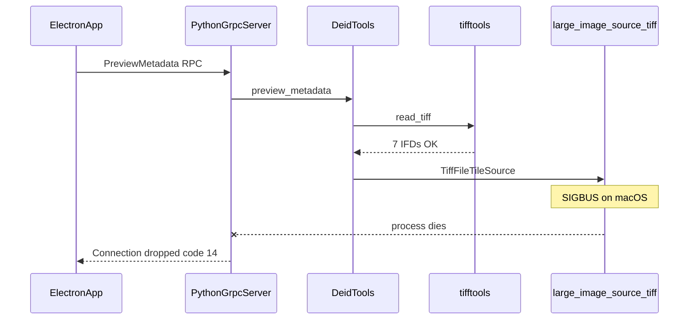

# Metadata preview failure on macOS — technical assessment

**Status:** Documented for later investigation. Windows metadata preview is working; macOS fails in native Python code before IFDs are returned.

**Last updated:** 2026-06-08  
**Test slide (Mac):** `/Users/Tom/Downloads/wsi/CMU-2-backup.svs`  
**Test slide (Windows):** `\\dummy\1661893.svs`

---

## Executive summary

Metadata preview in SlideRelabeler follows this path:

```
Viewer → Redux saga → Electron IPC → gRPC PreviewMetadata → DeidTools.preview_metadata()
```

After fixing the Viewer dispatch race and reverting `preview_metadata_isolated()` to in-process execution:

| Platform | Backend result | User-visible symptom |
|----------|----------------|----------------------|
| **Windows** | `PreviewMetadata OK prior=6 new=6`, `grpc-resp` with IFD counts | Metadata modal should populate (AgGrid) |
| **macOS** | Python process dies during `DeidTools.preview_metadata()` | gRPC `code: 14` / `Connection dropped`; modal stays on “Loading metadata preview…” |

**Root cause (macOS):** A **SIGBUS (signal 10)** native crash inside `large_image_source_tiff.TiffFileTileSource`, called from `DeidTools.redact_format_aperio()`. This is **not** a JavaScript, gRPC protobuf, or Redux bug.

**Important nuance:** `tifftools.read_tiff()` on the same file **succeeds** on Mac (7 IFDs read). The crash happens on a **second** open of the same SVS via the `large_image` TIFF tile source, used only to validate Aperio directory layout.

---

## What we fixed (and what this document is *not* about)

These issues were resolved separately and should not be re-investigated unless regressions appear:

1. **Viewer dispatch race** — Metadata fetch was skipped on first open because a 300ms deferred dispatch was cancelled by a React effect re-run. Fixed by a dedicated metadata `useEffect` keyed on Redux `ifds` cache.
2. **Subprocess isolation (`preview_metadata_isolated`)** — Spawning `multiprocessing.Process` from inside a gRPC servicer caused `fork_posix` warnings and child exit `-10` on Mac without returning data. Removed; `PreviewMetadata` now calls `preview_metadata()` in-process (same as pre-gRPC and same as `PreviewLabel` / `PreviewMacro`).
3. **gRPC IFD decode** — Bridge and saga normalize `{ prior_ifds, new_ifds }` from protobuf `Struct`. Verified working on Windows (`grpc-resp { priorLen: 6, newLen: 6 }`).

---

## Observed logs

### Windows (healthy)

```
[metadata-preview] ipc-in     → sourcePath, textColumn present
[metadata-preview] grpc-req   → same payload
[py stdout] [metadata-preview] PreviewMetadata OK prior=6 new=6
[metadata-preview] grpc-resp   → priorLen: 6, newLen: 6
```

### macOS (current failure)

```
[metadata-preview] ipc-in     → sourcePath, textColumn present
[metadata-preview] grpc-req   → same payload
[metadata-preview] grpc-error → code: 14, details: 'Connection dropped'
```

No `PreviewMetadata OK`, no `grpc-resp`. The Electron main process log shows `Error: 14 UNAVAILABLE: Connection dropped` from the `preview-metadata` IPC handler.

**Meaning of code 14:** The gRPC client lost its connection because the **Python engine process terminated abruptly** mid-RPC (typical when the process receives SIGBUS/SIGSEGV). This is different from code 13 (`INTERNAL`) where the server catches an exception and returns an error response.

### Earlier macOS failure (subprocess isolation, now removed)

When `preview_metadata_isolated()` was still in use:

- gRPC code **13** with `exit code -10` (child SIGBUS)
- Flood of `[py stderr] fork_posix.cc: Other threads are currently calling into gRPC`

That path mixed **multiprocessing + active gRPC threads** and still hit the same underlying SIGBUS in the child.

---

## Code path: `preview_metadata` on an Aperio SVS

Entry: [`src/python/engine.py`](../src/python/engine.py) → `PreviewMetadata` RPC → `preview_metadata(d)` → `deid_tools.preview_metadata(output_dict)`.

In [`src/python/DeidTools/DeidTools.py`](../src/python/DeidTools/DeidTools.py):

```python
def preview_metadata(self, output_dict):
    curItem, output_dir, tileSource, redactList, newTitle, labelImage, macroImage, func = self.setup_deid(output_dict)
    prior_ifds, new_ifds = func(curItem, output_dir, redactList, newTitle, labelImage, macroImage, preview_metadata=True)
    # ... serialize IFDs for JSON ...
```

For Aperio-format slides, `func` is `redact_format_aperio`. Relevant steps in order:

| Step | Location | Library | Mac result (CMU-2-backup.svs) |
|------|----------|---------|--------------------------------|
| 1 | `setup_deid()` | OpenSlide via `large_image` (`ImageItem.tileSource`) | OK (viewer side panel / label preview use this) |
| 2 | `get_deid_label()` | PIL / OpenSlide associated image | OK when label preview works |
| 3 | `tifftools.read_tiff(sourcePath)` | **tifftools** → libtiff | **OK** — 7 IFDs |
| 4 | `copy.deepcopy(ifds)` | Python stdlib | **OK** |
| 5 | `aperio_value_list()` | OpenSlide internal metadata | Not reached in bisect after step 3–4; assumed OK if step 3 runs |
| 6 | **`TiffFileTileSource(item._largeImagePath)`** | **large_image_source_tiff** | **SIGBUS — process dies** |
| 7 | IFD mutation, `preview_metadata=True` return | tifftools structures in memory | Never reached on Mac |

The crash site in source:

```433:484:src/python/DeidTools/DeidTools.py
    def redact_format_aperio(self, item, output_dir, redactList, title, labelImage, macroImage, preview_metadata=False):
        ...
        tiffinfo = tifftools.read_tiff(sourcePath)
        ifds = tiffinfo["ifds"]
        prior_ifds = copy.deepcopy(ifds)
        ...
        tiffSource = TiffFileTileSource(item._largeImagePath)
        mainImageDir = [
            dir._directoryNum for dir in tiffSource._tiffDirectories[::-1] if dir
        ]
        ...
        if mainImageDir != [ ... ]:
            raise Exception("Aperio directories are not as expected")
```

`TiffFileTileSource` is imported from the **`large_image_source_tiff`** conda package (not vendored in this repo). It exists solely to cross-check that TIFF directory numbering matches Aperio expectations before redacting IFDs.

---

## Bisect evidence (reproducible locally)

Run from repo with the `sliderelabeler` conda env and the test SVS present:

```bash
cd src/python
PYTHONPATH=. python <<'PY'
import copy
import tifftools
from large_image_source_tiff import TiffFileTileSource
from DeidTools.DeIdImageItem import DeIdImageItem as ImageItem

SVS = "/Users/Tom/Downloads/wsi/CMU-2-backup.svs"

tiffinfo = tifftools.read_tiff(SVS)
print("tifftools OK, ifds:", len(tiffinfo["ifds"]))

copy.deepcopy(tiffinfo["ifds"])
print("deepcopy OK")

item = ImageItem(SVS)
TiffFileTileSource(item._largeImagePath)  # Bus error: 10 on macOS
PY
```

Observed on macOS (2026-06-08):

```
tifftools OK, ifds: 7
deepcopy OK
Bus error: 10
```

Exit code 138 (= 128 + 10) confirms **SIGBUS**.

---

## What is *not* the root cause

| Suspected cause | Why it is ruled out |
|-----------------|---------------------|
| Invalid `textColumn` / font size 0 | Raises Python `ValueError` in `add_text_to_image`, not SIGBUS. Windows works with valid column; Mac crash occurs even with `add_text: False` in bisect. |
| `destinationDirectory: null` | `preview_metadata=True` returns in-memory IFDs before writing to disk; null output dir is normal for preview. |
| gRPC / protobuf decode | Windows proves encode/decode path; Mac fails before any Python success log. |
| `tifftools.read_tiff` alone | Bisect shows it completes and returns 7 IFDs on Mac. |
| Multiprocessing isolation (removed) | Same SIGBUS in child (`exit -10`) or in-process (`Connection dropped`); isolation only changed *which process dies*. |
| Viewer Redux / modal path lookup | Mac never reaches `SET_METADATA_PREVIEW`; `ifdsKeys` stay empty because backend never returns. |

---

## Libraries and environment

### Stack involved in metadata preview

```
SlideRelabeler engine.py
  └── DeidTools (in-repo)
        ├── tifftools (pip/conda) ──► libtiff (conda-forge)
        ├── large_image / large_image_source_tiff (conda) ──► libtiff / imagecodecs
        └── OpenSlide (openslide-python + openslide-bin) ──► used earlier in setup_deid / aperio_value_list
```

Conda env: [`environment-macos.yml`](../environment-macos.yml) — Python 3.12, `libtiff`, `large-image`, `large-image-source-tiff`, `openslide-*`, etc.

### In-repo acknowledgment of Mac TIFF issues

[`DeidTools.py` line 70](../src/python/DeidTools/DeidTools.py):

```python
# TODO: debug issue with libtiff large image source in MACOSX.
```

Commented Mac-specific **pylibtiff** ctypes patches appear in tests and [`engine_old.py`](../src/python/engine_old.py) (Apple Silicon / pearu/pylibtiff#178) but are **not active** in the current gRPC engine. Current code uses **tifftools** and **large_image_source_tiff**, not pylibtiff directly.

### Why preview label/macro can work while metadata fails

| RPC | DeidTools entry | Hits `redact_format_aperio` / `TiffFileTileSource`? |
|-----|-----------------|--------------------------------------------------------|
| `PreviewLabel` | `preview_label()` → `get_deid_label()` | **No** |
| `PreviewMacro` | `preview_macro()` → `get_deid_macro()` | **No** |
| `PreviewMetadata` | `preview_metadata()` → `redact_format_aperio(..., preview_metadata=True)` | **Yes** |

So the viewer can show label/macro previews and OpenSeadragon tiles (OpenSlide/large_image read paths) while metadata preview still crashes in the Aperio redaction pipeline.

---

## Failure modes summary



---

## Hypotheses for the native crash (not yet proven)

These are plausible follow-ups for a future Mac-focused fix; none were fully confirmed beyond the bisect pin at `TiffFileTileSource`:

1. **Double-open / conflicting TIFF readers** — Same SVS opened sequentially via tifftools (libtiff) and then `large_image_source_tiff` (possibly different libtiff bindings or memory-mapped I/O). macOS may be stricter about alignment or mapped regions → SIGBUS.
2. **large_image_source_tiff + Python 3.12 + conda libtiff** — Version skew between Homebrew-linked deps (e.g. harfbuzz/PIL seen in unrelated font tests) and conda `libtiff` could affect other native stacks; worth checking `conda list libtiff large-image tifftools` vs working Windows env.
3. **Aperio directory validation unnecessary for preview** — The `TiffFileTileSource` block validates layout but is not required to *return* prior/new IFDs when `preview_metadata=True`; skipping or replacing it with logic based on already-loaded `ifds` might avoid the crash (product/engineering fix in DeidTools, not in tifftools itself).
4. **Slide-specific TIFF edge case** — CMU-2-backup.svs may trigger a bug in `large_image_source_tiff` on Mac only; other SVS files on Mac should be tested before assuming all Aperio slides fail.

---

## Recommended directions (when we return to this)

Priority order if metadata on Mac becomes a requirement again:

1. **Short-term workaround in DeidTools** — For `preview_metadata=True` only, avoid `TiffFileTileSource` and derive directory indices from the `ifds` list already loaded by `tifftools`, or skip the strict `mainImageDir` check when previewing. Smallest change; keeps Windows behavior; needs validation that preview IFDs remain correct.

2. **Platform-specific process isolation (fallback)** — Thin CLI worker script importing DeidTools **without** gRPC, invoked via `subprocess.run` + JSON on Darwin only, so SIGBUS does not kill the long-lived gRPC server. Does not fix SIGBUS but restores graceful errors and server stability (as subprocess isolation attempted, but without `multiprocessing` inside gRPC).

3. **Native stack investigation** — Upgrade/downgrade pin `large-image-source-tiff`, `libtiff`, `tifftools`; reproduce with upstream minimal script; file issue against girder/large_image or tifftools if confirmed.

4. **UI polish (orthogonal)** — Saga/modal error state when `saga-catch` fires so users see failure instead of endless “Loading metadata preview…”.

---

## Repro kit and upstream brief

Runnable scripts outside the app: [`debug/mac-metadata-sigbus/`](../debug/mac-metadata-sigbus/README.md) (`run_all.sh`, numbered steps 00–09). Copy `config.example.env` → `config.local.env` and set `SVS_PATH`.

Standalone bug report for large_image (self-contained; inline repro scripts): [`debug/mac-metadata-sigbus/UPSTREAM_BRIEF.md`](../debug/mac-metadata-sigbus/UPSTREAM_BRIEF.md).

**Manual app test (Mac arm64):** `npm run dev` auto-enables the guard via [`patch_libtiff_platform.py`](../../src/python/patch_libtiff_platform.py). `./scripts/dev-patch-libtiff.sh` forces `SLIDERELABELER_PATCH_LIBTIFF=1`. Full Aperio processing and metadata preview verified on CMU-2-backup.svs with all three `tiff_reader` patches — see [`UPSTREAM_BRIEF.md`](../debug/mac-metadata-sigbus/UPSTREAM_BRIEF.md).

---

## Related files

| File | Role |
|------|------|
| [`debug/mac-metadata-sigbus/`](../debug/mac-metadata-sigbus/README.md) | Mac SIGBUS repro scripts + `UPSTREAM_BRIEF.md` |
| [`src/containers/Viewer/Viewer.jsx`](../src/containers/Viewer/Viewer.jsx) | Dispatches `GET_METADATA_PREVIEW` |
| [`src/sagas/viewer/watch_preview_metadata.js`](../src/sagas/viewer/watch_preview_metadata.js) | Saga → IPC → Redux `ifds` |
| [`src/bridge/grpcPythonBridge.js`](../src/bridge/grpcPythonBridge.js) | gRPC client, IFD decode |
| [`src/python/engine.py`](../src/python/engine.py) | `PreviewMetadata` RPC handler |
| [`src/python/DeidTools/DeidTools.py`](../src/python/DeidTools/DeidTools.py) | `preview_metadata`, `redact_format_aperio`, crash site |
| [`environment-macos.yml`](../environment-macos.yml) | Mac Python/native dependencies |

---

## Conclusion

- **Windows:** Metadata preview and Aperio processing work without the guard.
- **macOS arm64:** Root cause is ctypes misuse in `large_image_source_tiff/tiff_reader.py` conflicting with pylibtiff #189 (see UPSTREAM_BRIEF). Breaks all `TiffFileTileSource` paths including full redaction, not only metadata preview. Guard auto-enables on darwin/arm64 in [`engine.py`](../src/python/engine.py); override with `SLIDERELABELER_PATCH_LIBTIFF=0/1` or [`dev-patch-libtiff.sh`](../scripts/dev-patch-libtiff.sh). Permanent fix belongs upstream.
